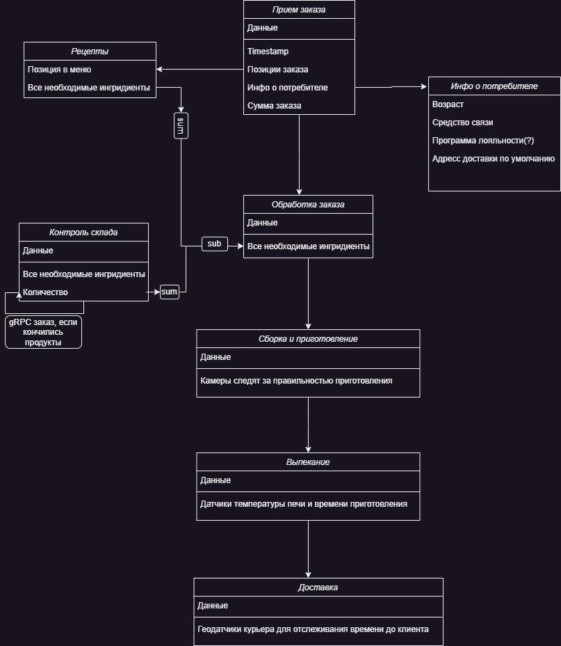
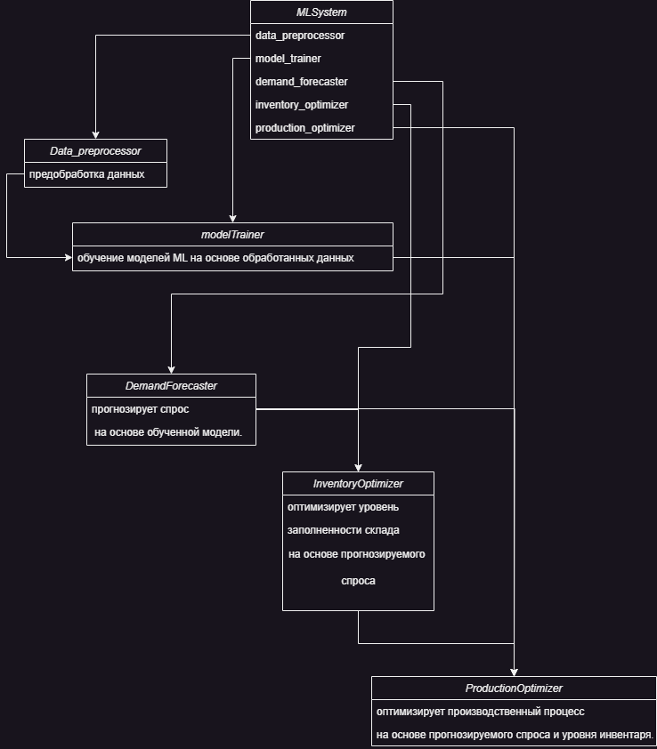
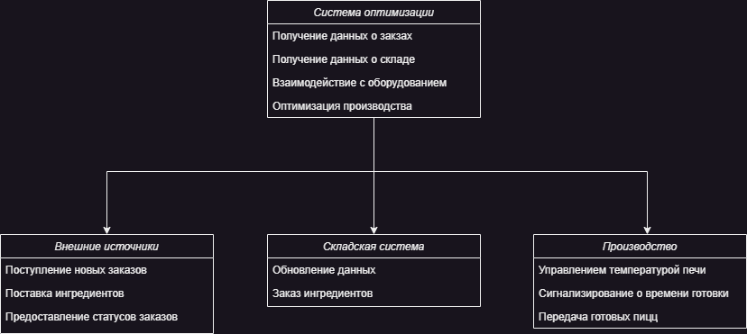
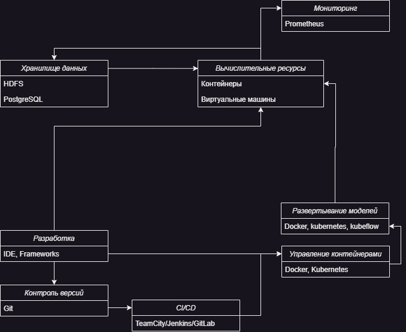

# Цель Бизнеса:
## Увеличить эффективность производства пиццы в сети ресторанов, сократив время приготовления и улучшив качество продукции.

# Цель задания: 
## Разработать документацию по требованиям и дизайну для системы оптимизации производства пиццы в сети ресторанов.

# Задачи
## 1.  Формулирование требований:
 ### - Соберите данные о производственном процессе приготовления пиццы (продумайте, какие данные могут быть и какие данные могут понадобиться).
 1. Временные данные:
    - Время, затрачиваемое на приготовление каждого вида пиццы.
    - Время, затрачиваемое на разогрев печи до рабочей температуры.
    - Время, затрачиваемое на охлаждение печи после окончания работы.
 2. Ингредиенты:
    - Список ингредиентов, необходимых для каждого вида пиццы.
    - Информация о качестве ингредиентов (например, свежесть, происхождение).
 3. Процесс приготовления:
    - Шаги приготовления каждого вида пиццы.
    - Технологические карты для каждого этапа приготовления.
 4. Оборудование:
    - Технические характеристики печей.
    - Информация о возможности автоматизации процесса (например, использование конвейерных печей).
 ### - Определите бизнес-цели системы: увеличение эффективности производства, сокращение времени приготовления и повышение качества продукции.
- Увеличение эффективности производства: максимизация количества пицц, приготавливаемых за определенный период времени
- Сокращение времени приготовления: Уменьшение времени, затрачиваемого на каждый этап приготовления пиццы.
- Повышение качества продукции: Обеспечение стабильного качества пиццы путем точного соблюдения рецептур и технологических процессов.
 ### - Специфицируйте функциональные и нефункциональные требования.
 #### - Функциональные требования
    - Автоматизированный заказ: Система должна позволять принимать заказы через онлайн-платформу или мобильное приложение.
    - Управление инвентарем: Вести учет запасов ингредиентов и автоматически заказывать их пополнение при необходимости.
    - Рецептуры и технологические карты: Хранить информацию о рецептурах каждого вида пиццы и последовательности выполнения этапов приготовления.
    - Мониторинг процесса: Отслеживать текущий статус приготовления каждой пиццы и предупреждать о возможных задержках или проблемах.
    - Оптимизация рабочего процесса: Предлагать оптимальное распределение задач сотрудникам для минимизации простоев и повышения производительности.
 #### - Нефункциональные требования
    - Надежность: Система должна быть стабильной и работать без сбоев в течение всего рабочего времени ресторана.
    - Производительность: Система должна обеспечивать быстрый доступ к данным и оперативную обработку заказов.
    - Безопасность: Обеспечение защиты конфиденциальности персональных данных клиентов и безопасности информации о заказах и ингредиентах.
    - Масштабируемость: Возможность расширения функциональности системы и добавления новых ресторанов без значительного увеличения нагрузки на серверы и инфраструктуру.
 ## 2. Разработка дизайн-документа
 - ### Создайте дизайн-документ, описывающий общую архитектуру системы и основные компоненты.
Система оптимизации производства пиццы состоит из следующих основных компонентов:
1. Модуль управления заказами:
    - Отвечает за прием заказов от клиентов через онлайн-платформу или мобильное приложение.
    - Взаимодействует с модулем управления инвентарем для проверки наличия ингредиентов.
2. Модуль управления инвентарем:
    - Отслеживает запасы ингредиентов и автоматически заказывает их пополнение при необходимости.
    - Получает информацию о заказах от модуля управления заказами для вычета используемых ингредиентов из запасов.
3. Модуль управления производственным процессом:
    - Отвечает за управление процессом приготовления пиццы в соответствии с рецептурами и технологическими картами.
    - Взаимодействует с оборудованием (печами) для управления температурой и временем приготовления.
4. Модуль мониторинга и аналитики:
    - Отслеживает производственные метрики, такие как время приготовления, количество заказов и использование ингредиентов.
    - Предоставляет аналитику о производственной эффективности и качестве продукции.
- ### Укажите интерфейсы между компонентами системы и внешними системами или источниками данных.
    - Модуль управления заказами взаимодействует с внешними системами для приема заказов и отправки подтверждений клиентам (Rest API).
    - Модуль управления инвентарем взаимодействует с поставщиками для автоматического заказа ингредиентов (gRPC).
    - Модуль управления производственным процессом взаимодействует с оборудованием (печами) для управления процессом приготовления (HTTP API).
- ### Опишите алгоритмы машинного обучения, которые будут использоваться для оптимизации производственного процесса.
    - Прогнозирование спроса: ARIMA для прогнозирования спроса на пиццу на основе исторических данных о заказах.
    - Оптимизация инвентаря: Модель EOQ для определения оптимального уровня запасов ингредиентов и оптимального времени заказа.
    - Оптимизация производственного процесса: Алгоритмы обучения с подкреплением для оптимизации времени и температуры приготовления пиццы.
- ### Сделайте и опишите подбор инструментов и технологий, используемых в системе
    - Язык программирования: Python для реализации алгоритмов машинного обучения и Golang для разработки серверной части системы.
    - Фреймворки: Gin для разработки веб-приложения и API (Golang). Pytorch для ML.
    - База данных: для дебаггинга и тестов - SQLite (легковесная). MVP - PostgreSQL. SCALE - MongoDB/Кластеризация с помощью Hadoop
    - Инструменты машинного обучения: Библиотека PyTorch для реализации алгоритмов машинного обучения. PyTorch предоставляет гибкие инструменты для разработки и обучения моделей машинного обучения.
    - Интеграция: gRPC и RESTful API для взаимодействия между компонентами системы и внешними системами.
## 3. Разработка диаграмм
- ### Постройте диаграмму потока данных, иллюстрирующую этапы производственного процесса от приема заказа до готовой пиццы.
    
- ### Создайте диаграмму классов, описывающую структуру и взаимодействие компонентов системы машинного обучения.
    
- ### Разработайте диаграмму последовательности, показывающую взаимодействие системы с внешними источниками данных и другими компонентами производственной среды.
    
## 4. Проектирование архитектуры:
- ### Определите подход к интеграции модели машинного обучения в производственный процесс (например, интеграция с оборудованием или с системой заказов)
    1. облепить датчиками печь для контроля температуры и времени печи и дать модели доступ к системе заказов для прогнозирования спроса
- ### Спроектируйте архитектуру системы, обеспечивающую масштабируемость, надежность и безопасность.
    1. Микросервисы:
    Разбить функциональность системы на небольшие, независимые микросервисы, каждый из которых будет отвечать за свою задачу. Например, сервис для обработки заказов, сервис для управления инвентарем, сервис для управления производством и т. д.
    2. Общение процессов:
    Использовать шину сообщений (например, Apache Kafka или RabbitMQ) для обмена данными между микросервисами. Это обеспечит гибкость и отказоустойчивость в коммуникации между компонентами системы.
    3. Контейнеризация как масштабируемость:
    Развернуть каждый микросервис в кластере, используя контейнеризацию и оркестратор контейнеров. Это позволит масштабировать приложения горизонтально, автоматически масштабируя количество экземпляров каждого сервиса в зависимости от нагрузки.
    4. Отказоустойчивость:
    Придумать способ репликации и шардирования до SCALE(после него работа будет вестись с Hadoop)
    5. Мониторинг и логирование:
    Использовать инструменты мониторинга (Prometheus) и логирования, чтобы следить за состоянием системы, выявлять проблемы и производить анализ производительности.

- ### Выберите инфраструктурные компоненты, необходимые для разработки, обучения и развертывания модели машинного обучения в производственной среде.
    1. Вычислительные ресурсы:

        Главная проблема проекта - придется потратить несколько сотен тысяч рублей на хорошие видеокарты или обезличить датасеты и обучать в GoogleColab модели. Если забыть про обучение моделей - Хватит несколько тачек и датацентров для хранения данных

    2. Хранилище данных:
    
        Храним данные в PostgreSQL, после SCALE - в HDFS
    3. Инструменты для разработки и обучения:

        IDE - любая, что нравится разработчикам - PyCharm, JupyterNotebook, Goland, Vscode
    4. Системы управления версиями:
        
        Git всему голова, однако как место хранения репозитория желательно использовать gitlab, т.к...
    5. CI/CD:
        
        Автоматизировать подъем контейнеров в GitLab намного проще засчет внутренней интеграции с Jenkins, TeamCity или встроенной системой CI/CD. Контейнервы поднимать будем Docker/Kubernetes и MLflow/Kubeflow.

    6. Инструменты мониторинга и логирования:
        Инструменты для мониторинга и логирования процессов обучения и производственного использования моделей, такие как Prometheus, Grafana, ELK Stack или Splunk.
- ### Постройте схему с архитектурой системы
